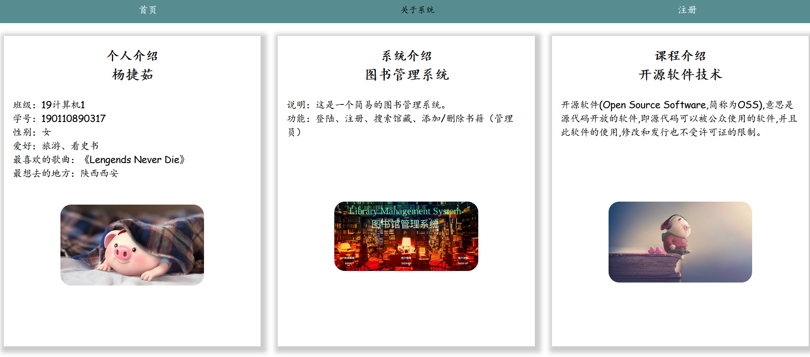
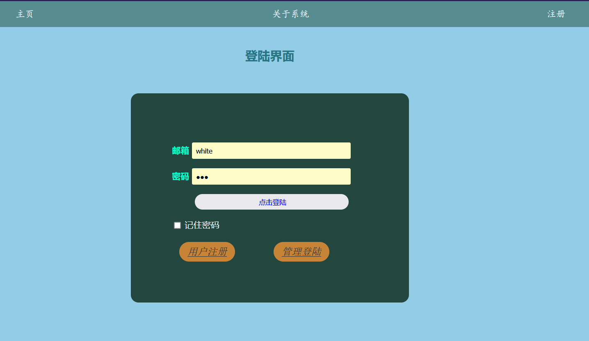
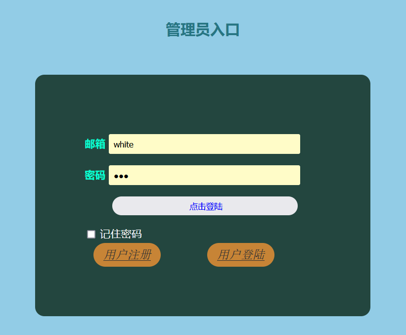
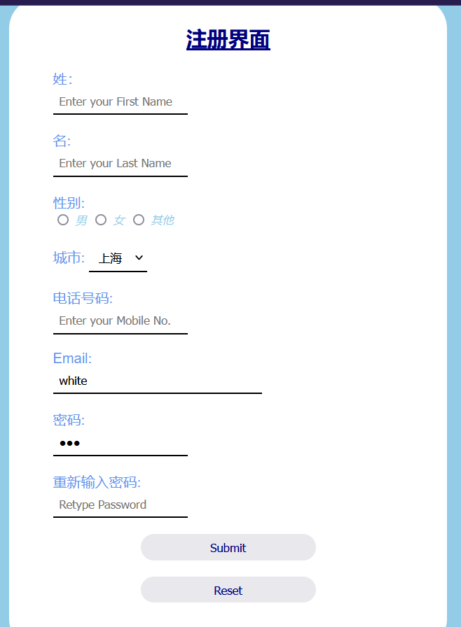
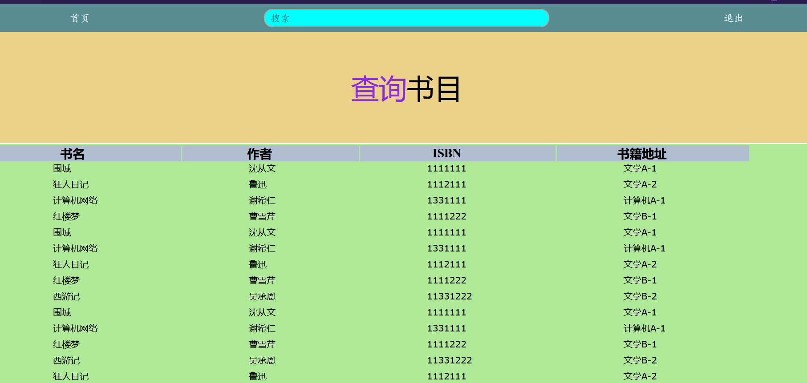
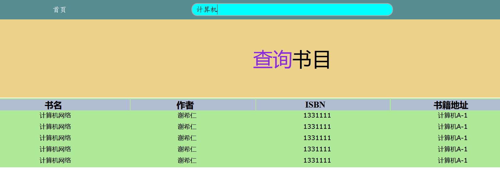
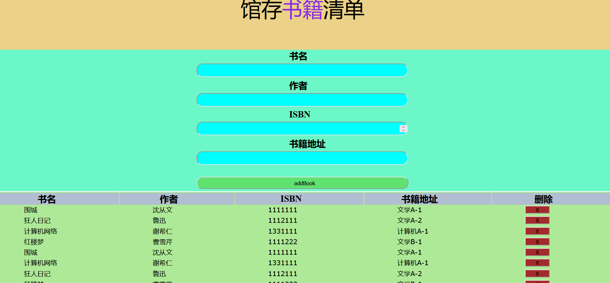

# 图书馆管理系统说明

[TOC]

## 1 项目设计部分

### 1.1 项目总体构成

使用了express+mongodb+node.js，这是一个简单的图书管理系统，进行了简单的页面设计，实现了基础的登陆注册功能，图书的添加和查询功能。

数据库设计如下：

（1）register注册表

| 字段名称  | 数据类型 |     中文说明     |
| :-------: | :------: | :--------------: |
| firstname |  String  |        姓        |
| lastName  |  String  |        名        |
|  gender   |  String  |       性别       |
|   city    |  String  |      所在地      |
|  mobile   |  String  |      手机号      |
| useremail |  String  | 邮箱（登陆账号） |
| password  |  String  |       密码       |

（2）book书表

| 字段名称 | 数据类型 | 中文说明 |
| :------: | :------: | :------: |
|  title   |  String  |   书名   |
|  author  |  String  |   作者   |
|   isbn   |  Number  |  ISBN号  |
|   link   |  String  |  藏书地  |

（3）admin管理员表

| 字段名称  | 数据类型 |     中文说明     |
| :-------: | :------: | :--------------: |
| useremail |  String  | 邮箱（登陆账号） |
| password  |  String  |       密码       |

### 1.2 引入的包在项目中的作用相关说明

#### 1.2.1 express

Express 是一个保持最小规模的灵活的 Node.js Web 应用程序开发框架，为 Web 和移动应用程序提供一组强大的功能。

#### 1.2.2 ejs

EJS 是一套简单的模板语言，帮你利用普通的 JavaScript 代码生成 HTML 页面。EJS 没有如何组织内容的教条；也没有再造一套迭代和控制流语法；有的只是普通的 JavaScript 代码而已。

#### 1.2.3 mongoose

- Mongoose 是一个让我们可以通过Node来操作MongoDB数据库的一个模块
- Mongoose 是一个对象文档模型（ODM）库，它是对Node原生的MongoDB模块进行了进一步的优化封装
- 大多数情况下，他被用来把结构化的模式应用到一个MongoDB集合，并提供了验证和类型装换等好处
- 基于MongoDB驱动，通过关系型数据库的思想来实现非关系型数据库

#### 1.2.4 bcrypt

是一个跨平台的文件加密工具。由它加密的文件可在所有支持的操作系统和处理器上进行转移。它的口令必须是8至56个字符，并将在内部被转化为448位的密钥。

#### 1.2.5 os

os 模块提供了一些基本的系统操作函数。

#### 1.2.6 PropTypes 

PropTypes提供一系列验证器，可用于确保组件接收到的数据类型是有效的。在本例中, 我们使用了 PropTypes.string。当传入的 prop 值类型不正确时， 控制台将会显示警告。出于性能方面的考虑，propTypes 仅在开发模式下进行检查。

#### 1.2.7 express-session

简单介绍：session 是另一种记录客户状态的机制，不同的是 Cookie 保存在客户端浏览器中，而 session 保存在服务器上。
用途：session 运行在服务器端，当客户端第一次访问服务器时，可以将客户的登录信息保存。 当客户访问其他页面时，可以判断客户的登录状态，做出提示，相当于登录拦截。session 可以和 Redis 或者数据库等结合做持久化操作，当服务器挂掉时也不会导致某些客户信息(购物车) 丢失。

#### 1.2.8 cookie-parser

方便向服务器发送数据，当服务器向客户端在响应头写入cookie，下一次发送请求会把cookie跟请求头一起发送给服务器。

### 1.3 项目目录结构和各个部分的说明

sever.js 相关包的引进，数据库连接以及表的创建与测试数据插入。

public：css样式表，图片以及页面js文件

views：页面文件

## 2 使用说明书 

### 2.1 首页

有3个入口，分别是关于系统，用户登陆和用户注册。

### 2.2 关于系统

包含个人介绍，系统介绍和课程介绍。

### 2.3 普通用户登录界面

管理员无法在普通用户界面登陆。

### 2.4 管理员登录界面

初始管理员邮箱：123

初始管理员密码：1234

### 2.5 注册界面

该页面需记住邮箱，注册完毕后通过邮箱登陆。

### 2.6 用户功能界面

可以查看馆藏的书，或者通过上方搜索栏对书名进行查询，如下图：

### 2.7 管理员功能界面

上方可以加入新书，下面点击删除栏中的按钮，可删除对应书。

注意：功能界面长时间不操作会退回到登录界面。

## 3 开发日记

第一次提交：完成了部分包下载，首页、登陆、注册页面的设计；

第二次提交：基本完成了页面设计；

第三次提交：完成了数据库连接及表的设计；

第四次提交：完成了基本功能；

第五次提交：完善功能，并进行测试;

第六次提交：测试成功；

第七次提交：完成了README.md的撰写

第八次提交：修改了README.md的错别字

第九次提交：远程数据库出现问题，第一次修正